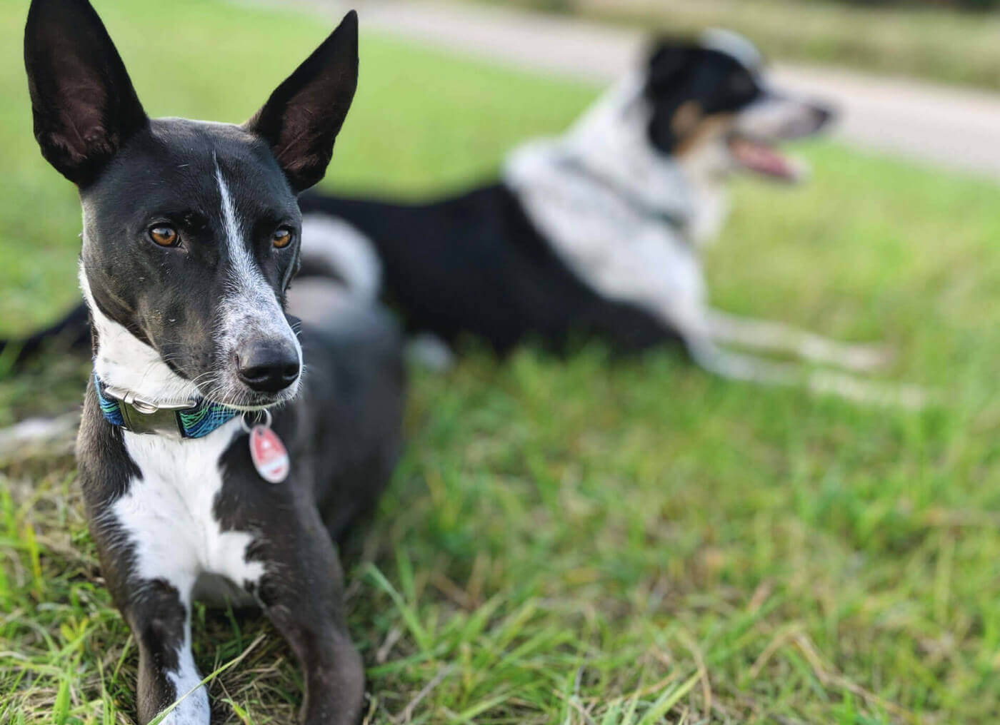

With a little delay, you also receive some happy new year greetings from me! Now that I have worked through the polite phrase, I would like to review the year 2019 and see what's been going on the last 12 months.

First, I would like to dedicate a few lines to my personal 2019. The year began very strenuously and gratifyingly at the same time. I moved into our new house together with my partner and our now two dogs. Yeah, you're reading perfectly. We have hairy offspring in the family, a wonderful second dog, which we can now give a cautious home as another member of the family.

All sorts of manual work had to be done as part of the move, so working hours suffered somewhat during this period. But our new house made it possible, among other things, to create an optimal working environment for me and allow me to focus on some thrilling things ahead!

Besides other exciting professional challenges, the year also presented me with an even greater private challenge. I had to deal with the bitter loss of a loved one. The challenges that life presents are often the toughest. This circumstance had to be processed throughout the year.

In the following, I would like to give you some insights into my business in 2019. The year began as <a href="../2019/2018-in-review">the previous one ended</a>. I continue to work on ReactPHP with passion, fun and focus. As a result, my professional commitment has developed into a profitable <a href="../support#consulting">business</a>. I accompanied this development with a total of <a href="../blog#2019">14 blog posts</a> last year. Besides, I also took part again in a number of events as a <a href="../talks#2019">speaker</a>. Something I thoroughly enjoy doing is to continuously evaluate the collected feedback to make sure that my blog posts and talks deliver value to you.

Furthermore, I have made great progress in answering my emails with outstanding support requests. It's quite possible that I had 200 open mails to answer in early 2019. These are probably *the dark sides* of maintaining successful <a href="../#projects">open-source projects</a> besides a well-running business. I was able to reduce this considerable number of emails to a ridiculous looking 19 mails. I continue doing my best to ideally get this number down to zero – or to at least make sure this number doesn't reach three digits again.

## Looking forward

Finally, I would like to look into the short- and mid-term future. At present, the conversion, renovation and refurbishment of the future office is in progress. In addition to working from home, this office will serve as a central contact point for me and my new employee Dennis. Say *hi!* to Dennis, who helped me a great deal with this blog post and upcoming ones. It is expected that the work on the new office will be completed during February, so we should be able to focus on releasing some exciting stuff very soon!

My focus will remain on ReactPHP and the sustainability of my open-source projects. Regarding sustainability, I will soon publish another blog post that explains and demonstrates this aspect of my business.

To conclude, putting this year-in-review together has been an enlightening experience: It reminded me just how different my life way only one year ago and how I could not have imagined the life I'm living now. For this year, I would like to end this post with my resolution, even when nobody on God's green earth keeps it. I vow to improve on the publication of my upcoming year-in-review for 2020 and promise to be more punctual for the end of this year. Cheers!
