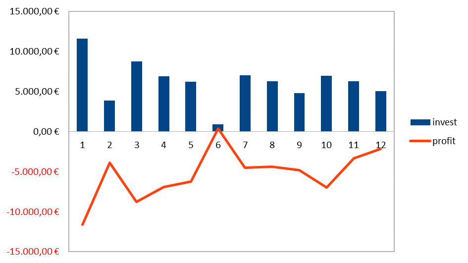

As announced in my [previous blog post](2019-in-review), I would like to use this post to clearly explain the aspect of [sustainability](https://24daysindecember.net/2019/12/15/open-source-sustainability/) for [my open-source projects](../#projects).
First, I would like to demonstrate this with a small calculation example.

Over the course of the last year, I have invested about **500 hours** of my working time in open-source projects.
The time tracked specifically includes time spent on triaging open issues and working on new features, but it does not include the time spent answering support requests, [writing my blogs](../blog) and preparing for my [public talks](../talks).
It's much harder to get an exact number here, but it's safe to estimate the total to be somewhere around 1000 hours.

Besides working on open-source projects, I work as a freelance software-engineering consultant, so I very well know what my time is worth (*if you're interested, [I'm available for hire](../support#consulting)*).
My hourly rates depend on the project size and requirements, so it's a bit hard to commit to a fixed number here.
What I know, last time I went to an official BMW car mechanic, I've been invoiced 125&nbsp;€/h, so I think it's fair to go with an hourly rate of 150 €/h for the following calculations.
I'll play fair here and apply a discount, so let's go with just the 500 hours, and let's take a look, **who paid for this?**



*This diagram compares the hours invested and the resulting profit, whereby the figures are for the respective months January 2019 to December 2019.* 

**Is open-source a sustainable business model?**
To draw the first conclusion, it is essential to say that over the whole year I have not received a corresponding value for my invested hours in this field of work.
June turns out to be the only month I made a profit – sadly simply because I spent less time working on open-source due to [personal events](2019-in-review).
However, a positive tendency can also be seen quite clearly towards the end of the year.
This growth must be continued in this year and revenues need to be increased in the long run.

Expressed again in pure numbers, this means:

```php
$invest = 75000;
$revenue = 9000;

$profit = $invest - $revenue;
echo $profit; // prints -66000
```

However, this simple calculation doesn't do justice to this topic in any way and does not say everything there is to say about the sustainability of my open-source activity.
Success in this area can by no means only be measured by the current profits.

There is so much more to consider here, for example, all the contacts and great people I got to know and all the projects that developed from great conversations.
But above all, all the fun and joy that this profession continues to bring with it.

So, taking into account the factors just mentioned, the calculation is now somewhat different:

```php
$invest = 75000;
$revenue = 9000;

$profit = $invest - $revenue;
$totals = $profit + $newfriends + $greatprojects + $fun;

var_dump($totals); // prints positive number
```

To summarize, it's been a fantastic year!
I would like to say that professionally, considering all the aspects mentioned, I can consider the year an absolute success.
Working as a freelancer definitely *is* a [successful business model](2019-in-review) and gives me a lot of freedom.
Working on open-source may not be sustainable business model for me in the short term right now, but things are slowly coming together for the long haul.
Best of all, there's reason to believe that the upcoming year will be no less successful.

## Looking Forward

In the future, it is important to use the already positive trend as a basis for this year to also make the financial aspect of my open-source activity more profitable.
This is necessary to continue investing many hours in open-source projects.

In December, I wrote a piece about [open-source sustainability](https://24daysindecember.net/2019/12/15/open-source-sustainability/) and how this is not just about *making money*, but rather having a solid, reliable base to build on top of.
It's still my understanding that if your project relies on some open-source projects for its business-critical features, it's in our best interest that these open-projects are sustainable.

As a measure in this regard, I made detailed adjustments to my sponsoring options and added sponsoring buttons to [my projects on GitHub](https://github.com/clue).
You can now [sponsor me on GitHub](https://github.com/sponsors/clue) or see my [sponsoring page](../support#sponsor) for more details.
This is not to be confused with a simple *donation*, so if you become a sponsor, you will also get something in return: dedicated support options, sponsor placements and some lovely stickers!

Let's go step by step, at the time of writing this, I'm receiving 4 $ per month through GitHub sponsors, but you know how to help me change this, right? :-)
I'm planning to evaluate the outcome at the end of the year and will sum this up in another sustainability report for 2020.
I would be very grateful for your feedback on this and other topics!

## A special thanks

I would like to conclude this post with thanking a special person understanding the importance of open-source.
Thank you [@geertvanbommel](https://github.com/geertvanbommel) for the extremely great cooperation, which we are now maintaining for some time.
Our cooperation is based on the elementary open-source idea and demonstrates what can evolve from it.
I hear there are going to be some awesome announcements very soon, so I'm not trying to give away too much here.
It is a real pleasure to develop ideas and implement them with you.
Among other things, Geert enables me to continue my passionate work on open-source besides purely commercial assignments.

Do you also care about sustainable open-source?
Remember you can now [sponsor me on GitHub](https://github.com/sponsors/clue) or see my [sponsoring page](../support#sponsor) for more details,
plus you get a chance to be mentioned in my upcoming sustainability report for 2020.
Looking forward to a great year 2020 and helping make open-source more sustainable! Cheers! 🎉
