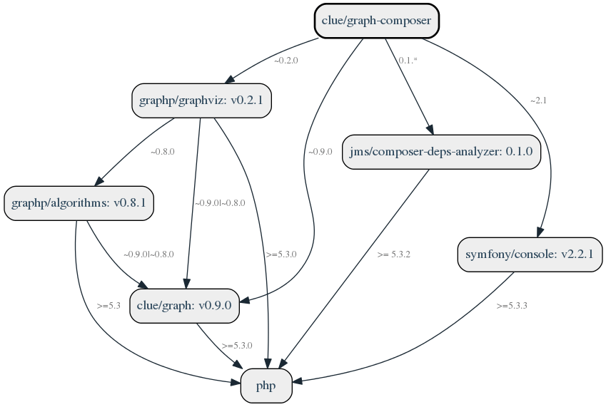

I am happy to inform you that version 1.1 of [clue/graph-composer](https://github.com/clue/graph-composer) is now available.
Over time I have received plenty of requests, suggestions for improvement and feedback on this project, so I would like to respond to this great interest with an updated version.


 
This example illustration should be pretty self-explanatory.
This graphical visualization shows the dependencies of your projects and their respective interdependencies.
Arrows between each package show the respective version constraints as defined in your `composer.json`.
This opens up completely new possibilities regarding the analysis and optimization of your projects.

## Quickstart in 60 seconds

Alright, now let's get this up and running for a quick demo on your own project.
The recommended way to install this project it by simply downloading the ready-to-use version as a Phar to any directory like this:

```bash
$ curl -JOL https://clue.engineering/graph-composer-latest.phar
```

Additionally, you need to install [GraphViz](https://www.graphviz.org/) which is used internally to draw the graph.
Debian/Ubuntu-based distributions may simply invoke:

```bash
$ sudo apt install graphviz
```

That's it already.
You can now execute it on the command line.
The `show` command renders a dependency graph for the current project directory and opens the default desktop image viewer for you:

```bash
$ php graph-composer.phar show
```

Looks awesome? *Yeah, it is*.
If you want to learn more about the technical details, please see the project page of [clue/graph-composer](https://github.com/clue/graph-composer).

## Further development of this project

This is a project that was unjustly neglected for some time after its first stable release in 2015. 
This is the result of the fact that [many other projects](../#projects) took up resources and some of them received less attention from my side. 
I developed this project during my studies and therefore it enjoys a special place in my heart.
Accordingly, the current general overhaul is long overdue.

In addition, we are currently evaluating the possibility of working on a new version 2.0 in the future.
We're planning some [cool new features](https://github.com/clue/graph-composer/issues?q=is%3Aissue+is%3Aopen+label%3A%22new+feature%22),
such as filtering and limiting the graph display for large projects and offering more output styles and formats.

If you are interested in [sustainable open-source](2019-sustainability-report) (*Note: you should*), you can help me continue my work on such fantastic open-source projects. 
Contributions are essential to continue working on these open-source projects in the future.
One way to help out would be to [sponsor me on GitHub](https://github.com/sponsors/clue) if you want us to keep making progress.
You are encouraged to send me your suggestions and to cooperate. Let's take this great project to the next level together.

I'd love to hear your feedback, use the comment section below or send a tweet to [@another_clue](https://twitter.com/another_clue). *Cheers!*
