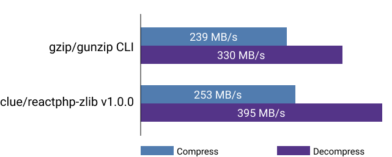

Today, [clue/reactphp-zlib](https://github.com/clue/reactphp-zlib) leaves the beta and appears in its first stable release `v1.0.0`.
It provides a streaming zlib compressor and decompressor for [ReactPHP](https://reactphp.org/), supporting compression and decompression of GZIP, ZLIB and raw DEFLATE formats.

## The beta is done - release!

The project has been started almost 5 years ago and has been used in production ever since.
During this beta phase, extensive optimizations and bug fixes were made, so today we are pleased to announce the first stable release version `v1.0.0` of [clue/reactphp-zlib](https://github.com/clue/reactphp-zlib).
You can check out the [release history](https://github.com/clue/reactphp-zlib/releases) for all the nifty details or keep reading for a quick overview.

Most importantly, it now operates at a faster speed and fixes a number of inconsistencies.
This results from the elimination of the project's legacy and taking advantage of PHP 7's [deflate contexts](https://www.php.net/manual/en/function.deflate-init.php).
As as consequence, this version now requires PHP 7 or newer (*was about time*).


You will find that new version is more than 25% faster!
This isn't just some arbitrary benchmarking number, this is a significant improvement in real-world applications when compressing or decompressing large files.

PHP isn't exactly known for being the *fastest* language and *faster* doesn't necessarily mean *fast*, so let's put this into perspective.
How does this project compare to compressing/decompressing files on the command line instead?



*Wow*, this isn't what we originally expected.
Even though both projects use the same underlying `zlib` libraries under the hood,
it looks like our project outperforms the `gzip` and `gunzip` command line tools!
This means processing compressed files in PHP can be faster than first decompressing on the command line and then processing the decompressed files in PHP.

Remember, you shouldn't trust strangers when it comes to benchmarking (*or candy*).
YMMV, so you're invited to run your own benchmarks and/or the [provided benchmarking scripts](https://github.com/clue/reactphp-zlib/pull/24) with your specific project and platform setup and report back.

Alright, enough with the numbers, now let's take a look at some code.
A fresh install is very simple, so here we go!

## Quickstart in 60 seconds

The recommended way to install this project is via Composer.

```php
$ composer require clue/zlib-react:^1.0
```

Once installed, you can use the following code read a gzipped log file and print each decompressed log file chunk:

```php
$loop = React\EventLoop\Factory::create();
$stream = new React\Stream\ReadableResourceStream(fopen('access.log.gz', 'r'), $loop);

$decompressor = new Clue\React\Zlib\Decompressor(ZLIB_ENCODING_GZIP);
$stream->pipe($decompressor);

$decompressor->on('data', function ($data) {
    echo $data; // chunk of decompressed log data
});

$loop->run();
```

If you've ever worked with [ReactPHP's streams](https://reactphp.org/stream/), this should be fairly straight-forward:
It prints some data that we get from piping a readable log file into the `Decompressor`.
To make this more interesting, let's process the resulting decompressed data stream instead of simply printing it to the command line.
For example, we can use this decompressed data stream to parse a compressed CSV file.
The full code to stream a CSV file and emit some message for each record could look something like this:

```php
$loop = React\EventLoop\Factory::create();
$stream = new React\Stream\ReadableResourceStream(fopen('users.csv.gz', 'r'), $loop);

$decompressor = new Clue\React\Zlib\Decompressor(ZLIB_ENCODING_GZIP);
$stream->pipe($decompressor);

$csv = new Clue\React\Csv\AssocDecoder($decompressor);
$csv->on('data', function ($user) {
    echo 'Hello ' . $user['name'] . PHP_EOL;
});

$loop->run();
```

This example demonstrates how after changing just a few lines of code, we can now trigger any kind of processing logic.
This applies to [CSV](https://clue.engineering/2018/introducing-reactphp-csv) just like it would apply to [NDJSON](https://clue.engineering/2018/introducing-reactphp-ndjson) or any other data format.

## Feature complete

This project exposes some of the most common and versatile compression formats.
We've seen how using compression and decompression in PHP can be surprisingly efficient.
The project is considered stable and feature complete and has been used in production for a few years already, so you're invited to also give it a try!
For more details, see the project homepage of [clue/reactphp-zlib](https://github.com/clue/reactphp-zlib).

In the future, we're planning to integrate this mechanism into some of our other components:
Among others, our [HTTP client](https://clue.engineering/2018/introducing-reactphp-buzz) will support HTTP compression to save bandwidth.
Additionally, we're going to show how this project can be used to work with compressed TAR archives (`.tar.gz` or `.tgz` tarball files) in our next blog.

We invest a lot of time to develop, maintain and update [our awesome open-source projects](https://github.com/clue?tab=repositories). 
If you are interested in [sustainable open source](https://clue.engineering/2020/2019-sustainability-report) *(note: you should)*, you can help us sustain this high-quality of our work by [becoming a sponsor on GitHub](https://github.com/sponsors/clue). Sponsors allow us to keep making progress and get numerous benefits in return, see our [sponsoring page](https://github.com/sponsors/clue) for details.

Let's take these projects to the next level together! 🚀

We love to hear your feedback, use the contact options in the section below and let's get in touch.
*Cheers!*
