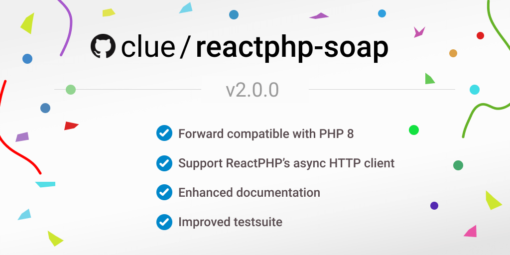

Today, I'm happy to announce the `v2.0.0` release of [clue/reactphp-soap](https://github.com/clue/reactphp-soap),
the simple, async [SOAP](https://en.wikipedia.org/wiki/SOAP) web service client library, built on top of [ReactPHP](https://reactphp.org). 🎉
The common opinion is that SOAP might be out of fashion.
We'll show that's not necessarily true and try to help make SOAP *the* trend again.

To answer the first thing you may be wondering: *Yes, it is 2020* and indeed, SOAP has been around for quite a while.
Like many others, we've been using SOAP for decades.
But now I may reveal the next stable version of our SOAP library, based on [ReactPHP](https://reactphp.org).
Most importantly, this release includes full support for the recent [react/http v1.0.0](../2020/announcing-reactphp-http).
In addition, we have also made further optimizations: Legacy issues and inconsistencies have been removed, the documentation has been revamped slightly and the test suite has been improved. 
As a consequence, we now support PHP 7.1+ and upcoming PHP 8.

So I think it's about time to write an updated blog post about this project.
Warning, I've also revised some terrible puns.



## Async SOAP requests

SOAP is not exactly a new protocol, but it's still commonly used for invoking [remote procedure calls](https://en.wikipedia.org/wiki/Remote_procedure_call) (RPCs) in distributed systems.
Today, it competes with more modern alternatives such as (RESTful) HTTP APIs, GraphQL, JSON-RPC and others.
I'm not going to argue that either approach would be best suited for your particular use-case, but I *will* argue that many SOAP APIs have clearly stood the test of time and continue to provide very real business value with little maintenance overhead. 
This remains something the more modern approaches to API design have yet to prove. 
Arguably, while RPCs formatted as XML sent over HTTP are not exactly network-efficient, this is not really a major concern for many of the more *enterprisey* applications out there.

Now you know what SOAP is, in the following we will briefly show you how it works:

```php
$wsdl = file_get_contents('service.wsdl');
$loop = React\EventLoop\Factory::create();
$browser = new React\Http\Browser($loop);
$client = new Clue\React\Soap\Client($browser, $wsdl);
$proxy = new Clue\React\Soap\Proxy($client);

$proxy->demo(1, 2)->then(function ($result) {
    var_dump('first result', $result);
});

$proxy->demo(3, 4)->then(function ($result) {
    var_dump('second result', $result);
});

$loop->run();
```

Admittedly, there's a lot of stuff going on, so let's take a look.
If we focus on the `$proxy` part, we can see that this example will execute two method calls.
These are our RPCs that will transparently be sent to the remote web service and allow us to react to the results of these calls, in this case dumping their results.

What's especially worth noting, however, is *how* this is executed.
Being entirely async, this piece of code will actually send two requests *concurrently*.
This means they both happen at the same time, i.e. the second call doesn't have to wait for the first one to complete.
In other words, if a single request takes 1 second to complete, then two requests will also take just 1 second (assuming ideal network conditions).
This is not just some theoretical construct, but something that bears some very significant real-world performance improvements.
To sum up, it is super fast!

If you want to learn more about the technical details behind this implementation, you can find all the details in our previous blog post for the [version 1 release](../2018/introducing-reactphp-soap).

## Concluding words

I think we all agree that especially these days soap exists for good reasons (*sorry*). 
SOAP may not be new and may not be pretty, but it's far from being dead and continues to be a common protocol when connecting to existing third-party APIs. 
This makes [clue/reactphp-soap](https://github.com/clue/reactphp-soap) an important piece of the puzzle of bringing ReactPHP to the masses, in particular when it comes to some of the more *enterprisey* APIs that offer very real business value. 
Thanks to ReactPHP's component-based design and its existing ecosystem, we can leverage its efficient network protocols to concurrently process a large number of requests, [throttle concurrency](../2018/introducing-reactphp-mq), [use HTTP proxy servers](../2018/introducing-reactphp-http-proxy) and much more.

If you want to learn more about this project, make sure to check out the project homepage of [clue/reactphp-soap](https://github.com/clue/reactphp-soap).
Its documentation describes common usage patterns as well as all the nifty details.

Finally, I would like to end this with some words of vital importance.
We invest a lot of time to develop, maintain and update [our awesome open-source projects](https://github.com/clue?tab=repositories). 
If you are interested in [sustainable open-source](../2020/2019-sustainability-report) *(note: you should)*, 
you can help us sustain this high-quality of our work by [becoming a sponsor on GitHub](https://github.com/sponsors/clue). 
Sponsors allow us to keep making progress and get numerous benefits in return, see our [sponsoring page](https://github.com/sponsors/clue) for details.

Let's take these projects to the next level together.

*Cheers* 🎉💥

> This blog post has originally been published with the [version 1 release of this library in 2018](../2018/introducing-reactphp-soap).
  You're viewing the updated blog post for the version 2 release.
