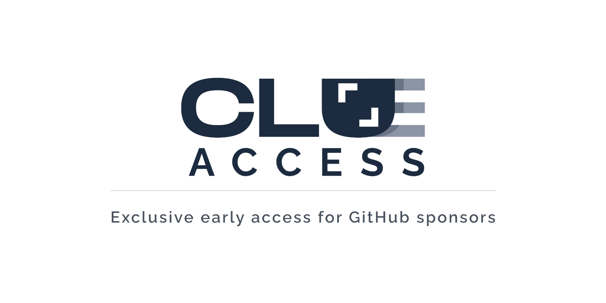

Today, we are happy to introduce you to [clue·access](https://github.com/clue-access/clue-access), our new exclusive early access for GitHub sponsors. 🎉
You get the best out of our projects – we get sponsors to help us focus on creating awesome projects.
Here you will find why we designed this concept, what it looks like in detail, how it works and what you can do to become a part of it.

## How it works

**We ❤️ open-source**! That's why we've published more than 100 projects on our GitHub ([@clue](https://github.com/clue)).

On top of this, we're constantly working on new projects. 
With **clue·access**, we want you to get early access to our new projects before they made available to the general public.
Supporters of our open-source work and people sponsoring us can now receive early access to our new projects.

​​[**clue·access**](https://github.com/clue-access/clue-access) is represented as an organization on Github. In this organization we have created a team to which the already supporting sponsors have been invited and some of them are already members. Each qualified sponsor will receive an invitation to the organization via e-mail and, once activated, will have full access to all included projects before they are made available to the general public. 

If you're not a member of this team, you will only be able to see the project overview, but will not be able to see and access [all the awesome projects](https://github.com/clue-access/clue-access#projects).
To allow a brief insight into each project, we have created public placeholder repositories. 
Oh, and it definitely helps with whetting the appetite for more. 😉

We believe in the power of open-source.
That's why we plan to publish these projects step by step for everyone eventually.
If you're patient, you can lean back. If you want to get the best out of our new projects and support open-source at the same time, you may want to check out [our sponsorship page]((https://github.com/sponsors/clue)).

We already have a number of ideas for further additions and concepts for **clue·access**.
For example, each member receives **exclusive access to our support channel**.

## Why clue·access?

It's really that simple: ***Because we believe open-source needs to be sustainable***. 

<blockquote class="twitter-tweet" data-lang="en" data-theme="light">
I love open-source! ❤️ And I believe working on open-source for a living should be sustainable 💸  Regularly deal with hundreds of features I don&#39;t have a use for.  Compensation should be a given. What do you think? 

    <a href="https://twitter.com/hashtag/sustainable?src=hash&amp;ref_src=twsrc%5Etfw">#sustainable</a> <a href="https://twitter.com/hashtag/opensource?src=hash&amp;ref_src=twsrc%5Etfw">#opensource</a>

    <a href="https://t.co/h8EqcenRsg"> https://t.co/h8EqcenRsg</a>
&mdash; Christian Lück (@another_clue) <a href="https://twitter.com/another_clue/status/1334456734988062721?ref_src=twsrc%5Etfw">December 3, 2020</a></blockquote>

We don't just preach it, we consistently work with this in mind.
Keeping with the motto *sharing is caring*, we have worked out a way to be able to publish our projects even earlier in the future.
Due to our high-quality demands on our projects, we have always gone the extra mile and have gone through a maturing process before sharing projects with you.
This maturing process now occurs in **clue·access**, together with you!

This concept was not born out of a desire for more sponsors, it was created as a thank you to our supporters who accompany us on this journey. Because it feels great to realize that we are pursuing the vision of **sustainable open-source** together. 🙏

This results in an inevitable win-win situation.

## Win-Win!

The quintessence: You get the best out of our projects – we get sponsors to help us focus on creating awesome projects. **Win-win**! 💪

We want you to have a chance to be involved in early project development stages. You get the chance to access our projects before they are made available to the general public and provide early feedback. We get the chance to collect feedback and know exactly what to focus on next. **Win-win** again! 💪

Let's not forget the financial aspect of working on open-source full-time. More sponsors mean we can spend more time on open-source. [Sponsorware](https://github.com/sponsorware/docs) is (you guessed it) **win-win**! 💪

## You want to be part of **clue·access**?

If you are interested in joining **clue·access** (*tip: you should*), then consider supporting our work. The easiest way to join would be [to sponsor us on GitHub](https://github.com/sponsors/clue) if you want us to continue creating even more awesome projects.

We invest a lot of time developing, maintaining and updating our awesome open-source projects. You can help us sustain this high-quality of our work by becoming a sponsor on GitHub. As you can see, sponsoring is a win-win situation. On top of this, our sponsors receive additional numerous benefits in return, details can be found on our [sponsorship page](https://github.com/sponsors/clue).

Let's take these projects to the next level together. 🚀

See you in **clue·access**. Cheers! 🎉💥
