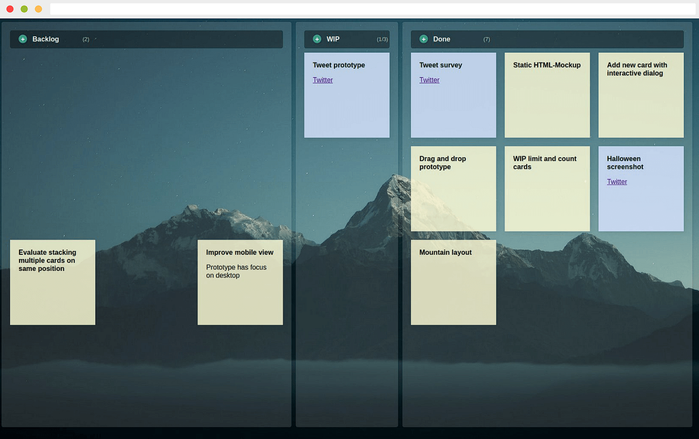

It's the turn of the year, so it's time for our year in review.
An enormous amount has happened, in almost every aspect.
We, **clue·engineering**, have expanded our team and with [**JustKanban**](https://justkanban.org) and [**clue·access**](https://github.com/clue-access/clue-access) we have two awesome main-projects on the road to [**sustainable open-source**](https://clue.engineering/2020/2019-sustainability-report).
Oh.. of course you also get some happy new year greetings from us! 🎉🎆

## Private flashback

In 2019, a lot of [things have changed](../2020/2019-in-review) in my private life.
This last year, I'm happy not too many things changed.
We are still busy furnishing our house, but I suppose change is the only constant in life.

Our two dogs are doing well and keeping us well on our toes.
The walks with our dogs are a very welcome distraction, especially at this time when the opportunities are very limited.
In fact, this has led me to discover some lovely trails in my rural area and nearby forest areas.
During the initial restrictions I've tracked more than 90 km walking per week, now I'm back to around 50 km/week.
All mostly from walking the dogs.

As you can see, no big changes in my private life. 
Why should there be, when everything is going well!

> Never change a winning team. ❤️

Unfortunately, it goes without saying the Corona virus has been omnipresent and will probably remain so for quite some time.
But we can only tackle this problem together, and each individual is called upon to do so.
I wish you all the strength to come out of this situation safe and healthy. 🙏 💪

## Professional retrospective

Financially, 2020 was a very successful year.
But more importantly, a lot of things have changed this year.
The 2020 **clue·engineering** is not the same as the 2019 one by any means.

Looking at [last year's review](../2020/2019-in-review), I think it's fair to say my personal business could be seen as *the* ReactPHP business. This was also part of my work this year.
Certainly, the [8th birthday of ReactPHP](../2020/announcing-reactphp-http) and the release of the very first stable version 1.0.0 of ReactPHP's HTTP library should be highlighted here.

This release also marks the first time we've actively promoted this process on Twitter, which made it a completely new experience for us.
Measured by the attention generated as well as the reception received, this is our most successful release so far.
For us, this confirms we're on the right track and we'll continue focusing our efforts on this in the future.

<blockquote class="twitter-tweet">
Happy birthday <a href="https://twitter.com/reactphp?ref_src=twsrc%5Etfw">@ReactPHP</a>! 🎂🎊  Now we can finally drop the bomb 💣  First stable v1.0.0 release of our event-driven, streaming HTTP client and server implementation for <a href="https://twitter.com/reactphp?ref_src=twsrc%5Etfw">@ReactPHP</a> is immediately available 🔥  Check out blog for details!  <a href="https://twitter.com/hashtag/async?src=hash&amp;ref_src=twsrc%5Etfw">#async</a> <a href="https://twitter.com/hashtag/php?src=hash&amp;ref_src=twsrc%5Etfw">#php</a> <a href="https://twitter.com/hashtag/http?src=hash&amp;ref_src=twsrc%5Etfw">#http</a> <a href="https://t.co/aswVUgU3hU">https://t.co/aswVUgU3hU</a>
&mdash; Christian Lück (@another_clue) <a href="https://twitter.com/another_clue/status/1281958432816472064?ref_src=twsrc%5Etfw">July 11, 2020</a></blockquote>

While it's true ReactPHP continues to be a very significant part of my professional career, there's so much more that's going on behind the scenes.
Perhaps most importantly, this is no longer a one-man show.
I'm super happy to welcome [Dennis](../2020/hello-dennis) and [Simon](../2020/hello-simon) to the **clue·engineering** team!

This means a big step for the company.
The various influences, based on the different careers and qualifications, had a significant impact on our work this year as well as our direction looking forward.
Of course, this also entails a big change in the financial situation for the company.
We're willing to accept this because we believe together we can achieve goals we couldn't reach as individuals.
Our work detailed below seems to confirm we're on the right track here.

Let's not forget these challenging times and the restrictions it comes with.
This has also been felt by us, although fortunately not as much as other industries or as in our private lives.
The reconstruction of our new office has been delayed somewhat, but we're fortunate our profession is very suitable for remote work.
Due to the pandemic, many events were cancelled at which I would have been a speaker.
As a result, many organizers decided to hold [online conferences](../talks#2020) instead.
This worked very well in parts, but will always remain only an imperfect alternative for me.
*Personal contact is irreplaceable in many aspects.*

All in all, this year has been a big success – although entirely different than what we would have expected last year.
Along the way, we've addressed a number of challenges and worked on a number of projects, two of which I'd like to highlight especially.

### JustKanban

I've been using paper kanban for years.
Kanban has allowed me to build hundreds of software projects, keep track of outstanding tasks and excel at cooperating with my business partners.

> Stickies on a wall are perfect for visualizing and managing ever-changing requirements.

With the new team hires and a global pandemic going on, meeting in our office to move these stickies is no longer an option.
Fortunately, there are dozens of digital kanban alternatives.
We've checked *all* of them.
Unfortunately, neither of them deliver what's required to replace our paper kanban.

If we're the experts in using kanban and building software projects, we're sure you get where this is going.
The decision matured to do it ourselves.
The name, clearly... JustKanban!

JustKanban is our prototype to transform our paper kanban into a digital one.
In fact, we've been using it track our work for a few months now and couldn't be happier!
We have some great plans for this in the future, so there's definitely more to come!

If you're curious, our prelaunch website with first insights into JustKanban is online, [check it out](https://justkanban.org).

### clue·access

In December, we've finally launched **clue·access** after working on this for months:

> **We ❤️ open-source**! That's why we've published more than 100 projects on our GitHub ([@clue](https://github.com/clue)).
>
> On top of this, we're constantly working on new projects. 
With [**clue·access**](https://github.com/clue-access/clue-access), we want you to get early access to our new projects before they made available to the general public.
Supporters of our open-source work and people sponsoring us can now receive early access to our new projects.
>
> – from [introducing clue·access](../2020/introducing-clue-access)

At the time of writing this, these completely new projects are available exclusively in early access for our supporters:

* [**clue/reactphp-pq**](https://github.com/clue/reactphp-pq) –
  PQ ("peak"), automatically wrap blocking functions in an async child process and turn blocking functions into non-blocking promises,
  built on top of [ReactPHP](https://reactphp.org/).

* [**clue/reactphp-tsv**](https://github.com/clue/reactphp-tsv) –
  Streaming TSV (Tab-Separated Values) parser and encoder for [ReactPHP](https://reactphp.org/).

* [**clue/make.php**](https://github.com/clue/make.php) –
  A GNU Make clone written in pure PHP. Run your Makefiles no matter whether GNU make is available.

* [**clue/reactphp-s3**](https://github.com/clue/reactphp-s3) –
  Async S3 filesystem API (supporting Amazon S3, Ceph, MiniIO, DigitalOcean Spaces and others),
  built on top of [ReactPHP](https://reactphp.org/).

* [**clue/reactphp-clickhouse**](https://github.com/clue/reactphp-clickhouse) –
  Blazing fast access to your ClickHouse database, built on top of [ReactPHP](https://reactphp.org/).

* [**clue/reactphp-memoize**](https://github.com/clue/reactphp-memoize) –
  Automatically memoize async function calls by caching function results,
  built on top of [ReactPHP](https://reactphp.org/).

All of these projects have been added this December alone, so expect even more projects the next time you [check out **clue·access**](https://github.com/clue-access/clue-access). 🚀

## Sustainable open-source

We love open-source! ❤️ And we believe working on open-source for a living should be sustainable 💸

Sustainable open-source is a beautiful ideal, but often times it's not the reality.
Is it sustainable for us? Not quite yet. But we're getting there.

To take another step on the road to sustainable open-source, [we have set up **clue·access**](../2020/introducing-clue-access).
We don't just want to preach *sharing is caring*, we want to live it.
We don't just want to constantly demand substainable open-source and stress its importance, we want to be the pioneers and do our part to make it successful.

To focus our efforts, we've started with our weekly [#ReleaseFriday](https://twitter.com/search?q=from%3Aanother_clue%20%23ReleaseFriday&src=typed_query&f=live) on Twitter.
We've used this opportunity to give some better insights into what projects we're working on and
release more new projects on a regular basis.
Among others, this allows us to promote these projects with some release notes highlighting awesome new features.

Our [clue advent calendar](https://twitter.com/another_clue/status/1333751450468556800) also deserves to be mentioned here.
Starting December 1st, we've published one new project release every single day.
A *little* underestimated in effort when this idea came up, but you have to finish it once you've started. 😅

<blockquote class="twitter-tweet">
This thread ... Christian is one man army <a href="https://twitter.com/hashtag/php?src=hash&amp;ref_src=twsrc%5Etfw">#php</a> 👏 <a href="https://t.co/MoKLJz67n7">https://t.co/MoKLJz67n7</a>
&mdash; Arkadiusz Kondas (@ArkadiuszKondas) <a href="https://twitter.com/ArkadiuszKondas/status/1341409230293753856?ref_src=twsrc%5Etfw">December 22, 2020</a></blockquote>

I have to disagree respectfully, as I could not have managed this on my own (*high five Dennis and Simon!*).
Without knowing whether we're going to take this on us again next year, we can say it makes us proud to have packed all 24 doors with small gifts.

While our business year has in fact been very successful, we can say working on open-source isn't sustainable for us yet.
Considering the new team hires mentioned above, it is even more important to put our business on a sustainable ground.
We still believe in sustainable open-source, but it continues to be a lot of work.
We're still doing the math for our year 2020 and will share a blog post with details soon.
In the meantime, you can also take a look at the [2019 substainability report](https://clue.engineering/2020/2019-sustainability-report)
or help out and become a [sponsor on GitHub](https://github.com/sponsors/clue).

## Looking Forward

Let's look in the crystal ball and see what's upcoming 🔮

[ReactPHP](https://reactphp.org/) continues to be a large focus of our work.
Previous years have been mostly about creating awesome, crazy-fast, super-efficient, lightweight PHP components for all kinds of different use cases.
We now have a large toolbelt of different building blocks for all kinds of requirements.

I constantly come across people enthusiastic about ReactPHP after learning about it.
We've built dozens of projects with ReactPHP and there are countless use cases where we could help.
But too many people don't know us yet. We need to put [ReactPHP](https://reactphp.org) on the map in 2021!
In the future, we want to focus on putting it all together and bringing ReactPHP to the masses.
It's more about showing people out there how powerful ReactPHP is and what awesome things can be done with it.
Let's leave the niche?

Along this path, we will continue to focus on sustainable open-source.
We believe in it, that's why we started our journey.
Open-source is ubiquitious.
And we will continue stressing its importance for each and every developer, but also the greater ecosystem.
To highlight this aspect of our business, we will soon publish another blog post with more details and the raw numbers.

In conclusion, this year has been a roller coaster ride with some ups and downs.
We're not complaining, it's just part of every *good* roller coaster.
After all, that's what makes it so exciting!
You often don't know what's hiding behind the next corner.
The goal is to enjoy the ride.
That's what we did and will continue to do, so look forward to new awesome projects!

Indeed, our next project has already been teased:

<blockquote class="twitter-tweet">
Let’s say somebody had this idea of a simple and lightweight, yet extremely powerful web application framework. Should work behind traditional web servers *and* standalone with <a href="https://twitter.com/reactphp?ref_src=twsrc%5Etfw">@ReactPHP</a>.  I wonder if there’s any interest in a micro framework like this? 🤔  Asking for a friend. <a href="https://t.co/ZE4fU8cXfY">pic.twitter.com/ZE4fU8cXfY</a>
&mdash; Christian Lück (@another_clue) <a href="https://twitter.com/another_clue/status/1346445806082129921?ref_src=twsrc%5Etfw">January 5, 2021</a></blockquote>

As you can see, we're not stopping here.
On the contrary, things are just getting started.
2021 will be a blast!

Happy New Year. *Cheers!* 🥂
