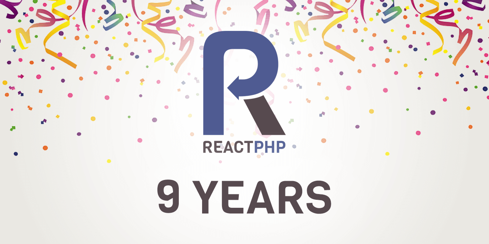

Today marks **ReactPHP's 9th birthday. 🎉**
And with today's release of the new default loop, using **ReactPHP has never been easier**!
Let's celebrate with a big birthday party to ensure you will also get a big piece of the birthday cake to taste. 🍰

We're releasing a new version of the EventLoop component,
the core reactor event loop that libraries can use for evented I/O.
On top of this, we've updated all our components to take advantage of the new EventLoop APIs:

* [**EventLoop `v1.2.0`**](https://reactphp.org/event-loop/)
* [Stream `v1.2.0`](https://reactphp.org/stream/)
* [DNS `v1.8.0`](https://reactphp.org/dns/)
* [Socket `v1.8.0`](https://reactphp.org/socket/)
* [HTTP `v1.4.0`](https://reactphp.org/http)
* [ChildProcess `v0.6.3`](https://reactphp.org/child-process/)
* [Datagram `v1.8.0`](https://reactphp.org/datagram/)
* [Promise-Timer `v1.7.0`](https://reactphp.org/promise-timer/)
* [ReactPHP meta package `v1.2.0`](https://github.com/reactphp/reactphp)

As you can see, we've been busy bees and
we're enthusiastic to ring in the next generation of async PHP!
You can check the [ReactPHP changelog](https://reactphp.org/changelog.html)
for all the details, but here's the gist: 

## ReactPHP has never been easier

Most notably, we've worked hard on a major update to our EventLoop API.
This work represents <em title="But there's more to come… 🤫">the first big step</em> in simplifying ReactPHP.
As a result, all other components of ReactPHP have been simplified somewhat as well.

We believe this is best illustrated with an example:

```php
<?php

require __DIR__ . '/vendor/autoload.php';

$server = new React\Http\Server(function (Psr\Http\Message\ServerRequestInterface $request) {
    return new React\Http\Message\Response(
        200,
        [
            'Content-Type' => 'text/plain'
        ],
        "Hello World!\n"
    );
});

$socket = new React\Socket\Server('127.0.0.1:8080');
$server->listen($socket);
```

This is a complete example that shows an async HTTP server written entirely in PHP with the help of ReactPHP.
In this example, we're using the HTTP component to create a simple web server that responds with "Hello World!" for every request and the Socket component to listen on the given address.
This is (now) everything you need to get started with ReactPHP.

Also noticed the much-improved EventLoop API?
Wait a moment, we didn't even interface with the EventLoop API at all?
That's the point!

What happened to the EventLoop? Read on!

## Default loop that doesn't get in your way

The EventLoop component provides the core reactor that libraries can use for evented I/O.
In other words, it's *THE* core component that's required throughout any
event-driven application to keep everything running.

The major change in the new `v1.2.0` EventLoop API is to make this EventLoop automatically available throughout your application.
This means the same EventLoop is still used, you just don't have to interface with its API anymore.
If you do want to use its API, typical applications would now use the new `Loop::get()` method to access the currently active EventLoop instance or directly use the static methods on the new `Loop` class like this:

```php
<?php

use React\EventLoop\Loop;

require __DIR__ . '/vendor/autoload.php';

$timer = Loop::addPeriodicTimer(0.1, function () {
    echo 'Tick' . PHP_EOL;
});

Loop::addTimer(1.0, function () use ($timer) {
    Loop::cancelTimer($timer);
    echo 'Done' . PHP_EOL;
});
```

In previous versions, you would have to explicitly create an EventLoop instance at the beginning,
reuse it throughout your program and finally run it at the end of the program.
In both cases, the program would perform the exact same steps.
But the new style is much more concise.

> “The purpose of abstraction is not to be vague, but to create a new semantic level in which one can be absolutely precise.”
> – Dijkstra

Already using ReactPHP's existing EventLoop APIs?
Don't worry, we too care about backwards compatibility!
While *we highly recommend using the `Loop` class*,
the explicit loop instructions are still valid and may still be useful in some applications,
especially for a transition period towards the more concise style.

See the [EventLoop documentation](https://reactphp.org/event-loop/#usage)
for more details about the new `Loop` API.

## The future of async PHP

It doesn't stop here!
We deeply care about our existing user base, but also about providing a path looking forward.
Today's releases mark a milestone, a major first step in making ReactPHP easier to use.
But there's so much more to come…

We're especially excited about built-in support for fibers being right around the corner.
Fibers will allow us to express program flow in a way that we don’t have to deal with the intricacies of async execution.
In other words, async programs will start to look no more complex than their synchronous counterparts.
We believe this will be a major new opportunity for async PHP ([read more](fibers-in-php)) and
we're excited to be among the first to take advantage of this.

Speaking of bridging the gap between traditional, synchronous PHP and the shiny world of asynchronous PHP:
We believe providing simple APIs to build common functionality, such as building web applications is one major step in bringing async PHP to the masses.
That's why we're more motivated than ever to continue working on [Framework X](https://framework-x.clue.engineering/) as one piece of this puzzle.

Besides this, we have some great plans for ReactPHP's components as well.
Trying not to give away too much here, but expect some major updates to our HTTP protocol support
and taking advantage of newer language level features in the future!
On top of this, we will continue our long-term support (LTS) promise (*see what I did there?*) and
will continue supporting the current version for the foreseeable future.

As you can see, we invest a lot of time to develop, maintain and update the ReactPHP ecosystem, which has tens of millions of installations.
If you like what we're doing and want to support our cause, consider [sponsoring our team](https://reactphp.org/#team).

Let's take these projects to the next level together... but before we do - let's have a kickass party!

*Hooray [ReactPHP](https://reactphp.org/)* 🎉💥
